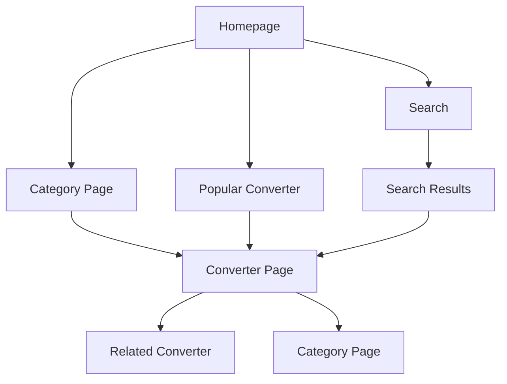

## 1. Product Overview

Convertaro.com is a global unit converter platform designed to capture massive organic traffic through programmatic SEO and monetize with display ads. The platform provides instant unit conversions across 10 categories with 300+ converters at launch, targeting under 1-second load times and 90+ Lighthouse scores.

**Target Market:** Students, professionals, engineers, and general users seeking quick unit conversions. The platform aims to become the go-to resource for unit conversions worldwide, competing with RapidTables and UnitConverters.

## 2. Core Features

### 2.1 User Roles

| Role | Registration Method | Core Permissions |
|------|---------------------|------------------|
| Visitor | No registration required | Access all converters, view ads |
| Admin | Secure admin panel | Manage converters, view analytics, update content |

### 2.2 Feature Module

Our unit converter platform consists of the following main pages:

1. **Homepage**: Hero search bar, popular converters grid, category navigation, quick converter tool
2. **Category pages**: Category-specific converter listings with explanations
3. **Converter pages**: Individual conversion tools with formulas, tables, FAQs, and related converters
4. **Search results**: Dynamic search results for converter discovery

### 2.3 Page Details

| Page Name | Module Name | Feature description |
|-----------|-------------|---------------------|
| Homepage | Hero section | Large search bar with instant converter suggestions, clean typography with blue accent colors |
| Homepage | Popular converters | Grid of 6-8 most used converters with quick access |
| Homepage | Category grid | Visual grid of 10 conversion categories with icons |
| Homepage | Quick converter | Instant conversion tool for common units |
| Category page | Category header | Title, description, and breadcrumb navigation |
| Category page | Converter list | Alphabetical list of all converters in category |
| Converter page | Conversion tool | Input field, unit selectors, instant result display |
| Converter page | Formula section | Mathematical formula explanation with examples |
| Converter page | Conversion table | Common conversion values table |
| Converter page | Explanation text | Educational content about units and their uses |
| Converter page | FAQ section | 3-5 SEO-optimized frequently asked questions |
| Converter page | Related converters | Internal linking to similar converters |
| Search results | Results list | Filtered converters based on search query |

## 3. Core Process

**User Flow:**
1. User lands on homepage via search engine or direct visit
2. User either searches for specific conversion or browses categories
3. User clicks on desired converter from search results or category page
4. User enters value and gets instant conversion result
5. User reads additional information (formula, table, FAQ)
6. User clicks related converters or returns to search

**SEO Flow:**
1. Search engine crawls programmatically generated pages
2. Structured data helps search engines understand content
3. Internal linking improves page authority distribution
4. Fast loading times improve search rankings
5. FAQ schema enhances rich snippet appearance

## 4. User Interface Design

### 4.1 Design Style

- **Primary colors:** Blue (#0066CC) for accents and CTAs
- **Secondary colors:** Light gray (#F5F5F5) for backgrounds
- **Button style:** Rounded corners with hover effects
- **Typography:** Large, clean sans-serif fonts (16px+ body text)
- **Layout:** Card-based design with generous white space
- **Icons:** Minimal line icons for categories and actions

### 4.2 Page Design Overview

| Page Name | Module Name | UI Elements |
|-----------|-------------|-------------|
| Homepage | Hero section | Full-width blue gradient background, large white search bar (40px height), 24px heading font |
| Homepage | Popular converters | 3-column grid on desktop, 2-column on tablet, single column on mobile, white cards with blue borders |
| Converter page | Conversion tool | Centered card with 48px input field, dropdown selectors, large result display (32px font) |
| Converter page | Formula section | Light blue background card, monospaced font for formulas, example calculations |
| Converter page | Conversion table | Striped table rows, hover effects, responsive horizontal scroll on mobile |

### 4.3 Responsiveness

Desktop-first design approach with mobile optimization:
- Breakpoints: 320px (mobile), 768px (tablet), 1024px (desktop)
- Touch-optimized input fields and buttons (minimum 44px touch targets)
- Responsive tables with horizontal scrolling
- Stacked layout on mobile devices

### 4.4 Ad Integration Layout

**Ad Positions:**
- Header banner: 728x90px (desktop), 320x100px (mobile)
- Sidebar ad: 300x250px (desktop only)
- In-content ad: 336x280px (responsive)
- Mobile sticky: 320x50px (mobile only)

**Ad Implementation:**
- Lazy loading for below-fold ads
- Ad containers with minimum height to prevent layout shift
- Responsive ad units that adapt to screen size
- Ad-free option for premium users (future feature)