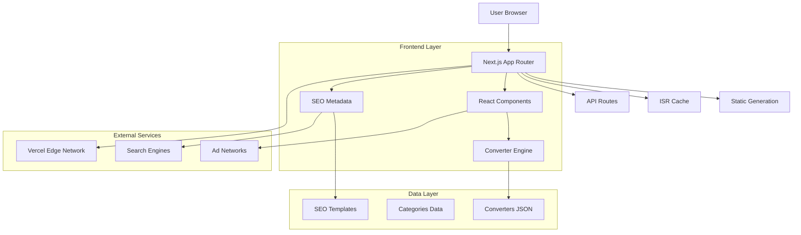

## 1. Architecture Design



## 2. Technology Description

- **Frontend:** Next.js 14 (App Router) + React 18 + TypeScript
- **Styling:** Tailwind CSS 3 + PostCSS
- **Deployment:** Vercel with Edge Functions
- **Performance:** Static Generation (SSG) + Incremental Static Regeneration (ISR)
- **Image Optimization:** Next.js Image Component
- **SEO:** Next.js Metadata API + Schema.org structured data
- **Analytics:** Vercel Analytics (optional)

## 3. Route Definitions

| Route | Purpose | Generation Method |
|-------|---------|-------------------|
| `/` | Homepage with search and categories | Static |
| `/search` | Search results page | SSR |
| `/[category]` | Category pages (length, weight, etc.) | Static |
| `/[category]/[converter]` | Individual converter pages | Static + ISR |
| `/sitemap.xml` | Dynamic XML sitemap | API Route |
| `/robots.txt` | Robots file for SEO | Static |

**Dynamic Routes:**
- `/length/cm-to-inches`
- `/weight/kg-to-lbs`
- `/temperature/celsius-to-fahrenheit`
- `/data/mb-to-gb`

## 4. Converter Data Structure

### 4.1 Core Converter Type

```typescript
interface Converter {
  id: string;
  category: string;
  fromUnit: string;
  toUnit: string;
  title: string;
  description: string;
  formula: string;
  inverseFormula: string;
  examples: ConversionExample[];
  faq: FAQItem[];
  relatedConverters: string[];
  metadata: {
    slug: string;
    keywords: string[];
    lastUpdated: string;
  };
}

interface ConversionExample {
  input: number;
  output: number;
  description?: string;
}

interface FAQItem {
  question: string;
  answer: string;
  keywords: string[];
}
```

### 4.2 Sample Converter Data

```json
{
  "id": "cm-to-inches",
  "category": "length",
  "fromUnit": "cm",
  "toUnit": "inches",
  "title": "CM to Inches Converter",
  "description": "Convert centimeters to inches instantly with our free online tool.",
  "formula": "inches = cm ÷ 2.54",
  "inverseFormula": "cm = inches × 2.54",
  "examples": [
    { "input": 10, "output": 3.937, "description": "10 cm to inches" },
    { "input": 30, "output": 11.811, "description": "30 cm to inches" }
  ],
  "faq": [
    {
      "question": "How many inches is 1 cm?",
      "answer": "1 cm equals 0.3937 inches.",
      "keywords": ["cm to inches", "1 cm in inches"]
    }
  ],
  "relatedConverters": ["inches-to-cm", "mm-to-inches", "feet-to-cm"]
}
```

## 5. Performance Optimization Strategy

### 5.1 Static Generation
- Pre-generate all 300+ converter pages at build time
- Use ISR with 24-hour revalidation for content updates
- Implement edge caching for sub-100ms response times

### 5.2 Code Optimization
- Tree-shake unused code
- Implement dynamic imports for heavy components
- Use React.memo for converter components
- Optimize bundle size with webpack analysis

### 5.3 Core Web Vitals Targets
- **LCP (Largest Contentful Paint):** < 1.0s
- **FID (First Input Delay):** < 100ms
- **CLS (Cumulative Layout Shift):** < 0.1
- **FCP (First Contentful Paint):** < 0.8s

## 6. SEO Implementation

### 6.1 Metadata Generation

```typescript
export function generateConverterMetadata(converter: Converter): Metadata {
  return {
    title: `${converter.title} - Free Online Tool | Convertaro`,
    description: converter.description,
    keywords: converter.metadata.keywords,
    openGraph: {
      title: converter.title,
      description: converter.description,
      type: 'website',
    },
    twitter: {
      card: 'summary',
      title: converter.title,
      description: converter.description,
    },
    alternates: {
      canonical: `https://convertaro.com/${converter.category}/${converter.metadata.slug}`,
    },
  };
}
```

### 6.2 Schema.org Structured Data

```typescript
export function generateConverterSchema(converter: Converter) {
  return {
    '@context': 'https://schema.org',
    '@type': 'WebApplication',
    name: converter.title,
    description: converter.description,
    url: `https://convertaro.com/${converter.category}/${converter.metadata.slug}`,
    applicationCategory: 'UtilityApplication',
    offers: {
      '@type': 'Offer',
      price: '0',
      priceCurrency: 'USD',
    },
    faq: converter.faq.map(item => ({
      '@type': 'Question',
      name: item.question,
      acceptedAnswer: {
        '@type': 'Answer',
        text: item.answer,
      },
    })),
  };
}
```

## 7. Ad Integration Architecture

### 7.1 Ad Component Structure

```typescript
interface AdUnitProps {
  adSlot: string;
  adFormat: 'horizontal' | 'vertical' | 'rectangle';
  responsive: boolean;
  className?: string;
}

const AdUnit: React.FC<AdUnitProps> = ({ adSlot, adFormat, responsive, className }) => {
  // Lazy load ad with intersection observer
  // Prevent layout shift with placeholder
  // Support multiple ad networks
};
```

### 7.2 Ad Positioning Strategy
- **Header:** 728x90 (desktop), 320x100 (mobile)
- **Sidebar:** 300x250 (desktop only)
- **In-content:** 336x280 (responsive)
- **Mobile sticky:** 320x50 (mobile only)

## 8. Deployment Configuration

### 8.1 Vercel Configuration

```json
{
  "buildCommand": "next build",
  "outputDirectory": ".next",
  "framework": "nextjs",
  "regions": ["all"],
  "functions": {
    "app/api/search/route.ts": {
      "maxDuration": 10
    }
  }
}
```

### 8.2 Build Optimization
- Enable Next.js standalone output
- Configure edge runtime for API routes
- Implement proper caching headers
- Use Vercel's edge network for global distribution

## 9. Monitoring and Analytics

### 9.1 Performance Monitoring
- Vercel Analytics integration
- Custom performance metrics collection
- Core Web Vitals tracking
- Error boundary implementation

### 9.2 SEO Monitoring
- Search Console integration
- Rank tracking for target keywords
- Click-through rate analysis
- Backlink monitoring